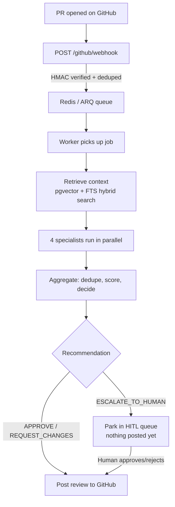

# AI PR Review Agent

A multi-agent pull-request reviewer. When a PR is opened, four specialist LLM agents
analyse the diff in parallel — security, code quality, test coverage, and documentation —
their findings are deduplicated and scored, and the result is either posted straight to
GitHub or escalated to a human for sign-off.

Reviews are grounded in your actual codebase via RAG (pgvector + full-text hybrid search),
and every LLM call is recorded as a cost/latency event so you can see exactly what each
review spent.

---

## How it works



The pipeline is a [LangGraph](https://langchain-ai.github.io/langgraph/) state machine —
see `backend/orchestrator/graph.py` for the node wiring and `nodes.py` for each step.

### The four specialists

| Agent | Looks for |
|---|---|
| **Security** | Hardcoded secrets, SQL/command injection, insecure deserialization, missing authz, SSRF/path traversal |
| **Quality** | Swallowed exceptions, missing error handling, resource leaks, dead code, leftover debug statements |
| **Tests** | Uncovered new code paths, missing edge cases, flaky patterns, skipped tests |
| **Docs** | Missing/incomplete docstrings, stale README, unlogged breaking changes, TODO/FIXME markers |

All four are implemented in `backend/agents/security.py`; `quality.py`, `tests.py`, and
`docs.py` are thin re-export shims.

### How the verdict is decided

Evaluated top-down in `backend/orchestrator/nodes.py`:

| Verdict | Condition | Effect |
|---|---|---|
| **ESCALATE_TO_HUMAN** | Any **CRITICAL** finding, **or** average confidence < 0.70 | **Does not post.** Queued in HITL for a human to approve/reject first |
| **REQUEST_CHANGES** | Any **HIGH** finding (no critical, confidence ≥ 0.70) | Posts a "changes requested" review |
| **APPROVE** | Only MEDIUM / LOW / INFO findings | Posts an approving review |

> **Note on self-reviews:** GitHub refuses a formal APPROVE/REQUEST_CHANGES from the same
> account that opened the PR. `GitHubClient` detects that 422 and automatically falls back
> to posting a `COMMENT`-type review instead. In real use, give the agent its own bot
> account so it can post proper verdicts.

---

## Tech stack

| Layer | Choice |
|---|---|
| API | FastAPI + Uvicorn |
| Queue | Redis + ARQ |
| Orchestration | LangGraph |
| LLM | Google Gemini (`google-genai`) — `gemini-2.5-flash` by default |
| Embeddings | `gemini-embedding-001` @ 256 dims |
| Storage | PostgreSQL / TimescaleDB (Tiger Cloud) + pgvector, via asyncpg & SQLAlchemy |
| Dashboard | Next.js 16 + React 19, Recharts, Framer Motion, lucide-react |
| Tests | pytest + pytest-asyncio (`asyncio_mode = auto`) |

---

## Project layout

```
backend/
  agents/          4 specialists + aggregator, schemas, base class with timeout guard
  api/             FastAPI app, webhook ingress, GitHub client, REST endpoints
  orchestrator/    LangGraph graph, nodes, shared review state
  memory/          RAG: embedder, chunk ingestion, hybrid retriever, Tiger client
  tools/           LLM client (+ mock fallback), per-agent model router
  observability/   Event tracker (spans, llm.call cost events), logging, tracing
  economics/       Cost repository, budget guard
  reliability/     Circuit breaker, retry with backoff, timeouts, idempotency
  hitl/            Escalation queue, feedback, disputes
  prompts/         Versioned prompt registry (never inline prompt text in agent code)
  migrations/      SQL schema migrations
frontend/          Next.js dashboard (reviews, HITL queue, economics, trace viewer)
scripts/           CLI utilities — see below
tests/             37 tests
```

### Design invariants

- **I1 — Clean architecture:** `backend/agents/*` never imports from `api/`, `queue/`, or
  `db/`. Enforced by a test in `tests/test_agents.py`.
- **I2 — Every agent call is timeout-guarded.** `BaseSpecialistAgent.run_with_timeout()`
  degrades to an empty finding list rather than hanging the pipeline.
- **Graceful degradation:** if the Gemini API is unavailable, `llm_client.py` falls back to
  a deterministic rule-based mock so the pipeline and test suite still work offline.

---

## Setup

### Prerequisites

- Python 3.14
- Redis (job queue)
- A PostgreSQL/TimescaleDB instance with `pgvector` (e.g. [Tiger Cloud](https://www.tigerdata.com/))
- ngrok (to expose your local webhook to GitHub)
- Node.js (only for the dashboard)

### 1. Install

```bash
pip install -r requirements.txt
```

### 2. Configure `.env`

Create a `.env` in the project root:

```bash
GITHUB_TOKEN=github_pat_...          # fine-grained PAT, needs Pull requests: Read and write
GITHUB_WEBHOOK_SECRET=...            # random string; paste the same value into GitHub
GITHUB_REPO=owner/your-repo
GEMINI_API_KEY=...                   # LLM calls + embeddings
TIGER_DATABASE_URL=postgresql://...  # Postgres/TimescaleDB connection string
REDIS_URL=redis://localhost:6379
```

Both entry points call `load_dotenv(override=True)`, so `.env` is the source of truth —
you don't need to export anything into your shell, and a stale exported value can't
shadow it. Restart the processes after editing `.env`.

Optional per-agent model overrides: `MODEL_SECURITY`, `MODEL_QUALITY`, `MODEL_TESTS`,
`MODEL_DOCS`, `MODEL_ORCHESTRATOR`.

> `gemini-2.5-pro` returns 404 on free-tier API keys, which is why every agent defaults to
> `gemini-2.5-flash`. Point the `MODEL_*` vars at pro if your key has the entitlement.

### 3. Apply migrations

```bash
python scripts/run_postgres_migrations.py
```

### 4. Index your codebase for RAG (optional but recommended)

```bash
python scripts/ingest_repo.py --repo .
```

---

## Running

Four terminals, from the project root:

| # | Purpose | Command |
|---|---|---|
| 1 | API server | `python -m uvicorn backend.api.main:app --host 0.0.0.0 --port 8000 --reload` |
| 2 | Worker | `python run_worker.py` |
| 3 | Public tunnel | `ngrok http 8000` |
| 4 | Dashboard *(optional)* | `npm run dev` (from `frontend/`) |

Then point a GitHub webhook at `https://<your-ngrok-url>/github/webhook`:

- **Content type:** `application/json`
- **Secret:** your `GITHUB_WEBHOOK_SECRET`
- **Events:** Pull requests only

Open a PR and the review lands within roughly 30–60 seconds. The dashboard runs at
`http://localhost:3000`.

`RUNNING_GUIDE.md` has the same flow in more detail plus a troubleshooting table.

---

## Dashboard

| Page | Shows |
|---|---|
| `/` | Review list, per-review findings with severity/confidence, feedback + dispute actions |
| `/hitl` | Escalated findings awaiting human approval — claim, comment, approve/reject |
| `/economics` | Daily spend, token totals, average latency, per-agent cost breakdown, budget guard |
| `/trace/[id]` | Full execution trace: every span, LLM call, token count, and latency |

The dashboard falls back to local mock data if the API is unreachable, so it's still
browsable with the backend down.

---

## API

| Method | Route | Purpose |
|---|---|---|
| `POST` | `/github/webhook` | GitHub ingress — HMAC-verified, deduplicated, enqueues a job |
| `GET` | `/api/reviews` | List review records |
| `GET` | `/api/reviews/{id}` | Single review |
| `GET` | `/api/reviews/{id}/findings` | Findings for a review |
| `GET` | `/api/reviews/{id}/trace` | Full event/span trace |
| `GET` | `/api/hitl/queue` | Unresolved escalations |
| `POST` | `/api/hitl/queue/{id}/claim` | Assign an item to a reviewer |
| `POST` | `/api/hitl/queue/{id}/resolve` | Resolve with APPROVE / REJECT |
| `GET` | `/api/economics` | Dashboard overview: spend, tokens, latency, per-agent costs |
| `GET` | `/api/economics/summary` | Cumulative spend summary |
| `GET` | `/api/economics/health` | Per-minute agent health from the TimescaleDB continuous aggregate |

Interactive docs at `http://localhost:8000/docs` while the server is running.

---

## Scripts

```bash
# Run the full pipeline against a diff file, no GitHub or DB needed
python scripts/dry_run.py --pr-diff tests/fixtures/sample.diff

# End-to-end smoke test with GitHub + HITL mocked out
python scripts/e2e_test.py

# Index a repository into the vector store
python scripts/ingest_repo.py --repo .

# Query the retriever directly
python scripts/retrieve.py --query "authentication middleware" --top-k 5
```

---

## Tests

```bash
pytest
```

37 tests covering webhook signature verification and deduplication, all four specialists,
aggregation and HITL routing, RAG grounding, observability events, and the GitHub client's
retry/circuit-breaker/dead-letter behaviour.

The suite never calls a real API — `.env` is not auto-loaded under pytest, so the LLM
client deterministically uses its rule-based mock.

---

## Reliability

- **Retry with exponential backoff** on GitHub API calls (3 attempts).
- **Circuit breaker** opens after 3 consecutive failures and short-circuits further calls.
- **Dead-letter logging** — a review that can't be posted logs `[DLQ] Review posting failed
  for PR N` instead of crashing the worker.
- **Idempotency** — GitHub delivery IDs are deduplicated at the webhook, and review
  persistence is `ON CONFLICT DO NOTHING`, so a redelivered webhook is a harmless no-op.
- **Budget guard** — daily spend cap with a configurable threshold.
